# Architecture Documentation - Numnia

Template basis: arc42 version 8.2, applied to the scope of the SRS [Requirements.md](../Requirements.md).

| Field | Value |
| --- | --- |
| Document type | Architecture documentation (arc42) |
| Version | 1.0 (initial, derived from SRS 1.1) |
| Status | Released for Release 1 build phase |
| Last updated | 2026-04-26 |
| Language | English (project documentation); in-product UI is Swiss High German per NFR-I18N-002/004 |
| Source | [docs/Requirements.md](../Requirements.md) |
| Translation note | Translated to English in April 2026. |

---

## 1. Introduction and Goals

### 1.1 Requirements Overview

Numnia is a web-based 3D math learning game for primary-school children (ages 7-12). It covers all four basic arithmetic operations up to the number range 1,000,000 and combines adaptive learning, gamification, turn-based multiplayer, and a school mode. The complete functional scope is defined in sections 1 and 6 of the SRS.

### 1.2 Quality Goals

| Prio | Quality goal | Rationale | Binding requirements |
| --- | --- | --- | --- |
| 1 | Safety and privacy for children (FADP/GDPR, CH hosting) | Target audience is minors; schools and parents are the primary trust givers | NFR-SEC-001..004, NFR-PRIV-001..002, FR-SAFE-001..006 |
| 2 | Learning effectiveness and pedagogical correctness | Success criterion is measurable learning progress | FR-LEARN-001..012, sections 6.1.1 / 6.1.2 |
| 3 | Operability with a small team (1-2 part-time people) | Cost-effectiveness, no 24/7 operations | NFR-OPS-001..003, FR-OPS-001..004 |
| 4 | Fair, friendly multiplayer experience | No frustration, no public exposure | FR-MP-001..008, FR-SAFE-001..006 |
| 5 | Performance and stability on school devices | Heterogeneous hardware, 3D load | NFR-PERF-001..004 |
| 6 | Engineering quality (Test First, TDD, BDD, craftsmanship) | Sustainable, regenerable codebase (AIUP principles) | NFR-ENG-001..006, section 11.4 |

### 1.3 Stakeholders

See SRS section 3. Architecturally relevant in particular: children (UX load), parents (consent / limits), teachers (school mode), school admins (onboarding), operators (CH self-hosting), content managers (LiveOps), data protection / legal.

---

## 2. Architecture Constraints

### 2.1 Technical Constraints

| Area | Requirement | Source |
| --- | --- | --- |
| Frontend | Node.js 24 LTS, pnpm 10.33.x, TypeScript 6.0.x, React 19.2.x, Babylon.js 9.4.x, Vite 8.0.x | SRS 4.1 |
| Backend | Java 25 LTS, Spring Boot 4.0.6 (Spring Framework 7.0.7), Spring Modulith 2.0.6, Maven Wrapper | SRS 4.1, ADR-002, ADR-011 |
| Persistence | PostgreSQL 18.3, Flyway 12.4.x | SRS 4.1 |
| Cache / Matchmaking | Redis 8.6 OSS | SRS 4.1 |
| Asset storage | Object storage (S3-compatible); see ADR-003 - MinIO repo archived Apr 2026, interim pin to last OSS release `RELEASE.2025-10-15T17-29-55Z`, target migration to Garage or SeaweedFS | ADR-003 |
| Communication | REST/GraphQL + WebSocket | SRS 4.1, 9.1 |
| API contract | OpenAPI 3.1 | SRS 4.1 |
| Build / tooling | Maven Wrapper (backend), pnpm 10.33.x (frontend), Docker, docker-compose | SRS 4.1 |
| Test tooling | JUnit Jupiter 6.0.x, AssertJ 3.27.x, Mockito 5.23.x, Testcontainers 2.0.x, Cucumber-JVM ≥ 7.34.3, Vitest 4.1.x, Playwright 1.59.x, @cucumber/cucumber 12.8.x | SRS 4.1 |

### 2.2 Organizational Constraints

- Hosting exclusively in Switzerland; no hyperscaler, no external CDN outside CH (NFR-OPS-003, SRS 4.2).
- Operations team: 1-2 part-time people, no mandatory 24/7 operations (NFR-OPS-001).
- Mandatory engineering practices: Test First, TDD for business logic, BDD for acceptance criteria, CI quality gates (NFR-ENG-002..004, SRS 11.4).
- Scope: Release 1 through Release 5 (SRS 12).

### 2.3 Conventions

- Project documentation, identifiers and code comments are written in English. In-product UI text aimed at children and parents is Swiss High German with umlauts and without sharp s (NFR-I18N-002, NFR-I18N-004).
- Stable IDs: FR-/NFR- from the SRS, UC- for use cases, ADR- for architecture decisions.
- Privacy by Design and Privacy by Default (SRS 4.3).

---

## 3. System Scope and Context

### 3.1 Business Context

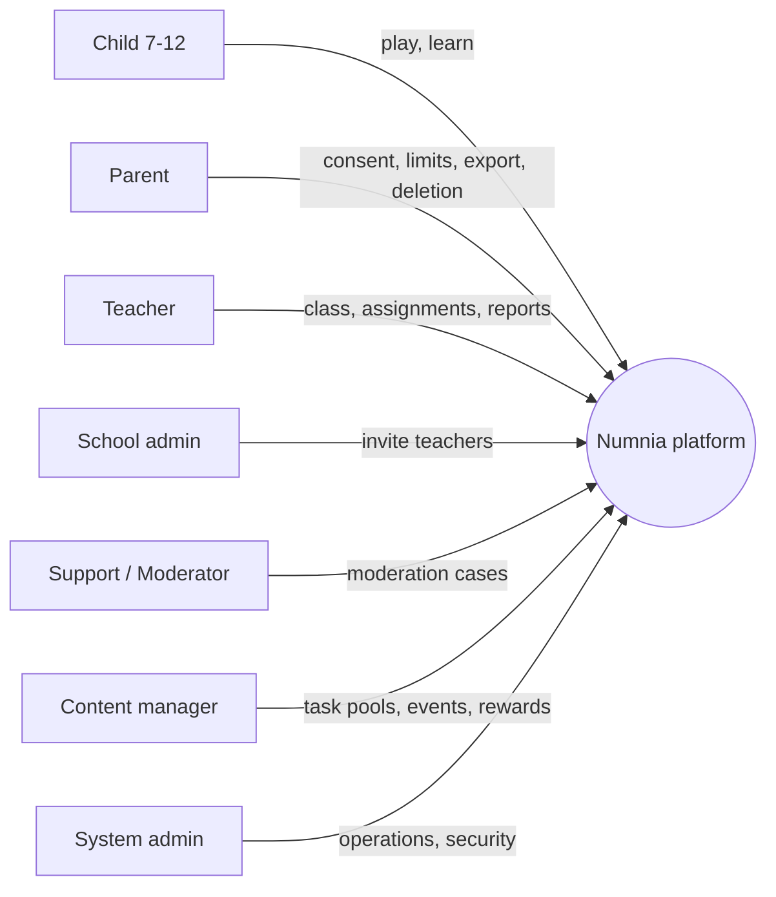

Relationships are strictly role-bound (see SRS 8). External educational SSO integrations are explicitly out of scope for the initial release (SRS 9.2).

### 3.2 Technical Context

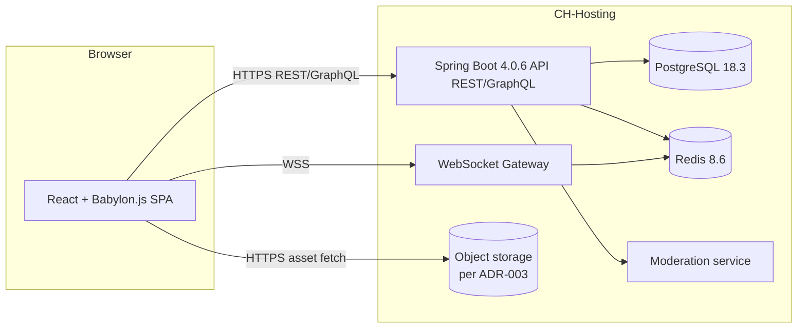

| Channel | Protocol | Protection goal |
| --- | --- | --- |
| Browser <-> API | HTTPS, JSON, OpenAPI 3.1 | Confidentiality, integrity, authentication (NFR-SEC-001..003) |
| Browser <-> WS | WSS, JSON frames | Multiplayer move processing p95 <= 500 ms (NFR-PERF-003) |
| Browser <-> Object storage | HTTPS, signed URLs | Asset confidentiality, no external CDN (NFR-OPS-003) |
| API <-> DB | TLS, connection pool | Data location CH (NFR-OPS-003, NFR-PRIV-001) |
| API <-> Cache | TLS or network segment | Sessions, matchmaking |

---

## 4. Solution Strategy

| Quality goal | Solution approach |
| --- | --- |
| Safety / privacy | Data minimization in the data model, server-side validation and authorization (least privilege), pseudonymization of child identification, double opt-in before multiplayer / communication, complete audit logs. |
| Learning effectiveness | Adaptive engine as a dedicated bounded context (difficulty S1-S6, pace G0-G5, spaced repetition, mastery thresholds from SRS 6.1.1, frustration protection from 6.1.2). |
| Operability | Modulithic Spring Boot 4.0.6 backend service plus React SPA, all deployed via docker-compose; LiveOps configuration without code deployment (FR-OPS-001, FR-OPS-002). |
| Multiplayer fairness | Turn-based model (FR-MP-001), level-based matchmaking, bot fallback, rankings limited to class / friends circle. |
| Performance | 3D assets with LOD / streaming from object storage, lazy world loading, server p95 <= 500 ms, backpressure and controlled degradation. |
| Engineering quality | Test pyramid JUnit / Mockito / AssertJ + Testcontainers + Playwright + Cucumber; CI gates block merges (NFR-ENG-004); semi-annual toolchain review (NFR-ENG-005). |

---

## 5. Building Block View

### 5.1 Whitebox Overall System (Level 1)

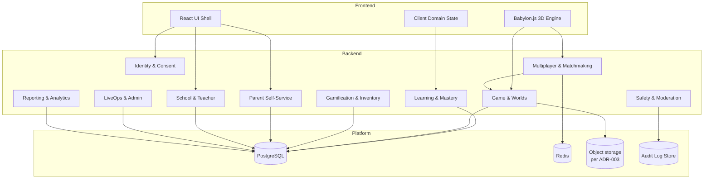

| Building block | Responsibility | Key requirements |
| --- | --- | --- |
| Identity & Consent | Accounts, roles, double opt-in, sessions, pseudonymization | FR-SAFE-006, NFR-SEC-001..003 |
| Learning & Mastery | Task generator, adaptive engine, spaced repetition, mastery thresholds | FR-LEARN-001..012 |
| Game & Worlds | Worlds, portals, game modes, session control | FR-WORLD-001..005, FR-GAME-001..006 |
| Multiplayer & Matchmaking | Turn logic, matching, bot fallback, class-internal rankings | FR-MP-001..008 |
| Gamification & Inventory | Star points, items, avatars, shield + round pool | FR-GAM-001..006, FR-CRE-001..007 |
| Parent Self-Service | Limits, risk mechanic toggle, export, deletion | FR-PAR-001..005 |
| School & Teacher | Classes, approvals, homework, reports | FR-SCH-001..007 |
| LiveOps & Admin | Events, seasons, task pools, moderation | FR-OPS-001..004 |
| Safety & Moderation | Communication filter, auto-hide, audit | FR-SAFE-001..005 |
| Reporting & Analytics | Learning state, operational monitoring | FR-GAME-005, FR-OPS-004 |

### 5.2 Level 2 - Learning & Mastery Whitebox

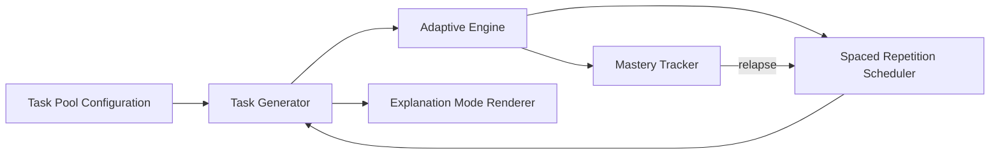

- The generator caps results at 1,000,000 (FR-LEARN-002).
- The adaptive engine applies frustration protection: 3 errors / time-outs in a row -> pace downgrade (G-1) plus mode suggestion (FR-LEARN-006, SRS 6.1.2).
- The mastery tracker maintains accuracy, median answer time, and calendar-day consolidation (FR-LEARN-009, FR-LEARN-012, SRS 6.1.1).
- The spacing scheduler implements re-test intervals of 3/5/7/10/14 days (SRS 6.1.2).

### 5.3 Level 2 - Multiplayer & Matchmaking Whitebox

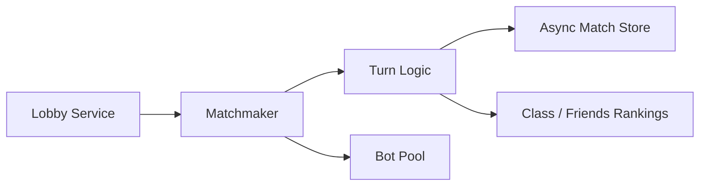

- Strictly turn-based (FR-MP-001), move time limit derived exclusively from G levels (FR-MP-004).
- The matcher uses level, accuracy, pace, fairness, and connection quality (FR-MP-005).
- Global rankings are out of scope (FR-MP-007); visibility is limited to class / friends circle with fantasy names (FR-MP-008).

---

## 6. Runtime View

### 6.1 Training Mode Session (FR-LEARN-001..009, FR-GAME-001/005)

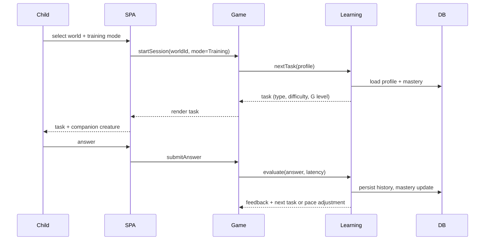

### 6.2 Parent Double Opt-in (FR-SAFE-006, FR-PAR-001)

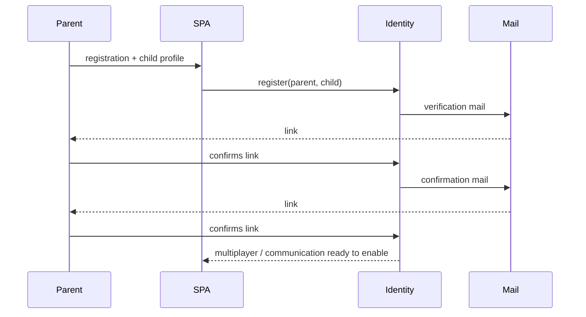

### 6.3 Turn-Based 1v1 with Bot Fallback (FR-MP-001..006)

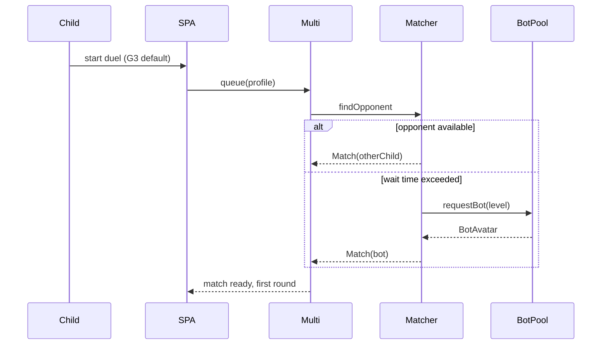

### 6.4 Parent Triggers Data Export (FR-PAR-004, NFR-PRIV-002)

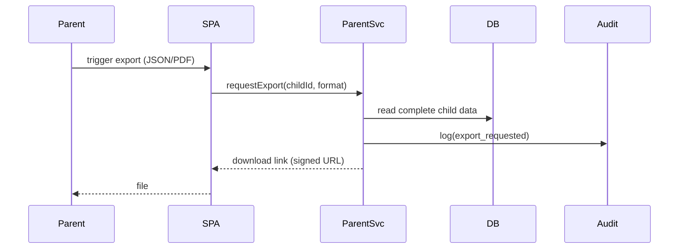

---

## 7. Deployment View

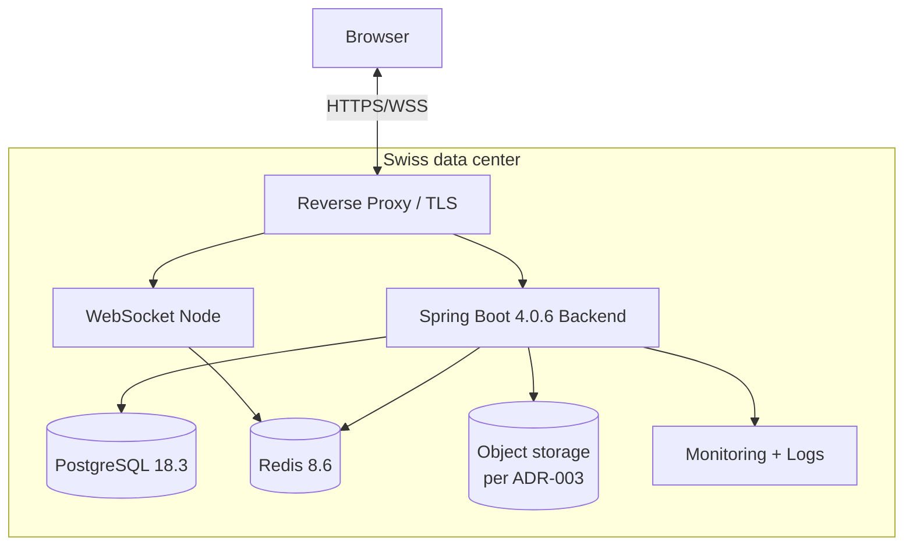

- All nodes in CH; no backups outside CH (NFR-OPS-003).
- Container orchestration via docker-compose (SRS 4.1/4.2).
- Scaling primarily vertical; horizontal scaling of WebSocket nodes via sticky sessions on Redis pub/sub.

---

## 8. Cross-cutting Concepts

### 8.1 Security

- TLS-only (NFR-SEC-001), server-side input validation (NFR-SEC-002), role / permission enforced server-side (NFR-SEC-003), rate limiting plus bot protection on auth and critical endpoints (NFR-SEC-004).
- Double opt-in before activation of multiplayer / communication (FR-SAFE-006).
- Pseudonymized child identification (SRS 10.1), no precise location data, no free-form contact information, no advertising tracking (SRS 10.2).
- Audit log for security-relevant actions (FR-SAFE-005).

### 8.2 Privacy and Data Storage

- Data minimization in the data model and processes (NFR-PRIV-001).
- Self-service export (JSON/PDF) and deletion with deletion proof (FR-PAR-004, FR-PAR-005, NFR-PRIV-002).
- Data and backups in Switzerland; restore test at least monthly (NFR-OPS-002, NFR-OPS-003).

### 8.3 Learning Pedagogy (cross-cutting)

- Mastery thresholds, retention threshold, calendar-day consolidation per SRS 6.1.1.
- Frustration protection, success corridor 70-90 %, re-test intervals 3/5/7/10/14 days per SRS 6.1.2.
- Mastery and difficulty parameters are configurable without code deployment (FR-OPS-002, AP-02).

### 8.4 Gamification

- Star points are the only soft currency, exclusively earned through play (FR-GAM-001/002).
- No permanent losses through errors (FR-GAM-005); loss mechanic only as an opt-in, reversible variant (FR-GAM-006).
- Avatar items remain permanently in the inventory, with gender-neutral base models (FR-CRE-005, FR-CRE-006).

### 8.5 Multiplayer Fairness and Child Protection

- Turn-based without real-time pressure (FR-MP-001), no global rankings (FR-MP-007).
- Communication limited to predefined signals, emojis, short sentences (FR-SAFE-001/002).
- Fantasy names from a vetted list (FR-SAFE-003).
- Auto-hide on suspicion and moderation case management (FR-SAFE-004, FR-OPS-003).

### 8.6 Internationalization

- Swiss High German and English (NFR-I18N-001).
- Swiss High German consistently without sharp s, with umlauts (NFR-I18N-002, NFR-I18N-004).
- Audio paths for both languages (NFR-I18N-003), word problems linguistically calibrated to grade-level reading ability (SRS 6.1.2).

### 8.7 Accessibility and UX

- Dyscalculia mode with reduced stimulus density and longer time limits (NFR-A11Y-001).
- Color-blind profiles for deuteranopia / protanopia / tritanopia (NFR-A11Y-002).
- Reduced motion (NFR-A11Y-003), screen reader for the parent / teacher area (NFR-A11Y-004), keyboard operability for the child flow (NFR-A11Y-005).

### 8.8 Performance

- p75 TTI <= 4 s on typical school devices (NFR-PERF-001).
- p75 world transition <= 5 s with warm cache (NFR-PERF-002).
- p95 server response <= 500 ms excluding network latency (NFR-PERF-003).
- Controlled degradation under load spikes (NFR-PERF-004).

### 8.9 Engineering Quality (Software Craftsmanship, AIUP)

- Clean Code, SOLID, small increments (NFR-ENG-001).
- Test First and TDD for new or changed business logic (NFR-ENG-002).
- BDD/Gherkin for acceptance criteria, executed in CI (NFR-ENG-003, NFR-ENG-004).
- Coverage thresholds: backend >= 80 % line / 70 % branch, frontend >= 70 % line (NFR-ENG-006).
- Semi-annual toolchain review (NFR-ENG-005, AP-03).

### 8.10 Operations and LiveOps

- Admin configuration for events, seasons, rewards without code deployment (FR-OPS-001).
- Task pools configurable live with versioning (FR-OPS-002).
- Health / status view and operational metrics (FR-OPS-004).

---

## 9. Architecture Decisions

| ID | Decision | Rationale | Reference |
| --- | --- | --- | --- |
| ADR-001 | Stack Selection (Java/Spring Boot, React+Babylon SPA, PostgreSQL, Redis, MinIO, OpenAPI 3.1) - see [ADR-001](../adr/ADR-001-stack-selection.md) | Long LTS, mature test ecosystem, native fit for self-hosted CH single-node | NFR-OPS-001..003, NFR-ENG-001..006, SRS 4.1 |
| ADR-002 | Java 25 LTS and full stack version refresh (April 2026) - supersedes parts of ADR-001 - see [ADR-002](../adr/ADR-002-java25-and-version-refresh.md) | LTS horizon, unblocks Spring Boot 4 + cucumber-spring 7.34.3 | NFR-ENG-001..006 |
| ADR-003 | Object storage: interim MinIO pin (last OSS release `RELEASE.2025-10-15T17-29-55Z`), target migration to Garage or SeaweedFS before launch - supersedes the MinIO selection of ADR-001 - see [ADR-003](../adr/ADR-003-object-storage-minio-replacement.md) | MinIO repo archived Apr 2026 (moved to paid AiStor) | NFR-OPS-003 |
| ADR-004 | PostgreSQL as primary persistence, Redis only for session / matchmaking - see [ADR-004](../adr/ADR-004-postgresql-primary-redis-secondary.md) | Relational learning histories and audit, cache only where needed | SRS 4.1, NFR-PRIV-001 |
| ADR-005 | OpenAPI 3.1 as API contract, GraphQL only where aggregation is required - see [ADR-005](../adr/ADR-005-openapi-3-1-rest-graphql-only-where-needed.md) | Contract-driven development, clear versioning | SRS 9.1 |
| ADR-006 | WebSocket only for multiplayer and live events - see [ADR-006](../adr/ADR-006-websocket-only-for-multiplayer.md) | Avoids unnecessary stateful connections | FR-MP-001, NFR-PERF-003 |
| ADR-007 | Bounded contexts aligned with SRS chapters 6.x - see [ADR-007](../adr/ADR-007-bounded-contexts-aligned-with-srs.md) | High functional cohesion, AIUP traceability per use case | SRS 6 |
| ADR-008 | Mastery thresholds, G levels and task pools are configuration data - see [ADR-008](../adr/ADR-008-mastery-and-task-pools-as-configuration.md) | LiveOps without code deployment, pilot fine-tuning possible | FR-OPS-002, AP-02 |
| ADR-009 | Test pyramid: JUnit Jupiter 6.0.x / AssertJ 3.27.x / Mockito 5.23.x + Testcontainers 2.0.x, Cucumber-JVM ≥ 7.34.3 for BDD, Playwright 1.59.x for E2E - see [ADR-009](../adr/ADR-009-test-pyramid.md) | Fulfills NFR-ENG-002..004 | SRS 4.1, 11 |
| ADR-010 | docker-compose as standard orchestration - see [ADR-010](../adr/ADR-010-docker-compose-orchestration.md) | Operability with a small team | SRS 4.2 |
| ADR-011 | Modulithic Spring Boot 4.0.6 backend instead of microservices - see [ADR-011](../adr/ADR-011-modulith-over-microservices.md) | Small operations team, clear module boundaries are sufficient for Releases 1-3 | NFR-OPS-001, SRS D-10 |

Further ADRs will be added in `docs/adr/ADR-XXX-*.md` as detailed questions materialize during the construction phase.

---

## 10. Quality Requirements

### 10.1 Quality Tree (excerpt)

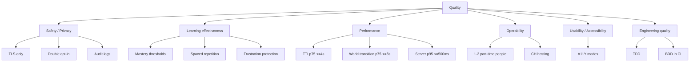

### 10.2 Quality Scenarios (examples)

- Security: A parent account triggers double opt-in. Until link #2 is confirmed, multiplayer and communication cannot be activated for the child (FR-SAFE-006).
- Learning effectiveness: Three consecutive errors in domain D within one task round trigger a G downgrade plus a mode suggestion (SRS 6.1.2).
- Performance: With 200 concurrent multiplayer moves, server response time p95 stays below 500 ms (NFR-PERF-003).
- Operability: A new season event is activated via the admin UI without code deployment (FR-OPS-001).
- Engineering quality: A pull request with a red BDD suite cannot be merged (NFR-ENG-004).

---

## 11. Risks and Technical Debt

| Risk / Debt | Impact | Mitigation | SRS reference |
| --- | --- | --- | --- |
| 24 worlds + 24 creatures are content-intensive | Delay of the target build-out | Release plan R1-R5, content pipeline from R5 onward | SRS 13.1, 12 |
| 3D performance on school devices | UX issues, drop-off rate | LOD, asset streaming, reduced-motion default for low-end devices | NFR-PERF-001/002, NFR-A11Y-003 |
| Moderation effort despite restrictive model | Personnel costs, loss of trust | Auto-hide, prioritization, audit | FR-SAFE-004, FR-OPS-003 |
| Balance of motivation vs. learning effectiveness | Lack of effectiveness | Pilot-class validation, parametric thresholds | AP-02, SRS 6.1.1 |
| Trademark / domain check for Numnia still open | Launch risk | AP-01, acceptance gate before R1 | SRS D-14, AP-01 |
| AIUP discipline not maintained (spec before code) | Drift between docs and code | Mandatory prompts / skills in the repo, CI gate on use-case references | NFR-ENG-001..004 |

---

## 12. Glossary

| Term | Meaning |
| --- | --- |
| Adaptive engine | Component in Learning & Mastery that dynamically adjusts difficulty (S) and pace (G). |
| Double opt-in | Two-step parental consent before activation of sensitive functions. |
| G levels | Pace levels G0-G5 with configurable time limits. |
| LiveOps | Operations-side configuration of events, seasons and rewards without code deployment. |
| Mastery | Confirmed learning state per content domain per SRS 6.1.1. |
| Pilot class | Vetted Swiss primary-school class for validating mastery thresholds (AP-02). |
| Portal | Entry point into a world, rule-based unlock (FR-WORLD-003/004). |
| Star points | Only soft currency, exclusively earned through play (FR-GAM-001/002). |
| S levels | Difficulty levels S1-S6. |
| Use case | Specification in `docs/use_cases/UC-XXX-*.md`, AIUP-compliant. |
